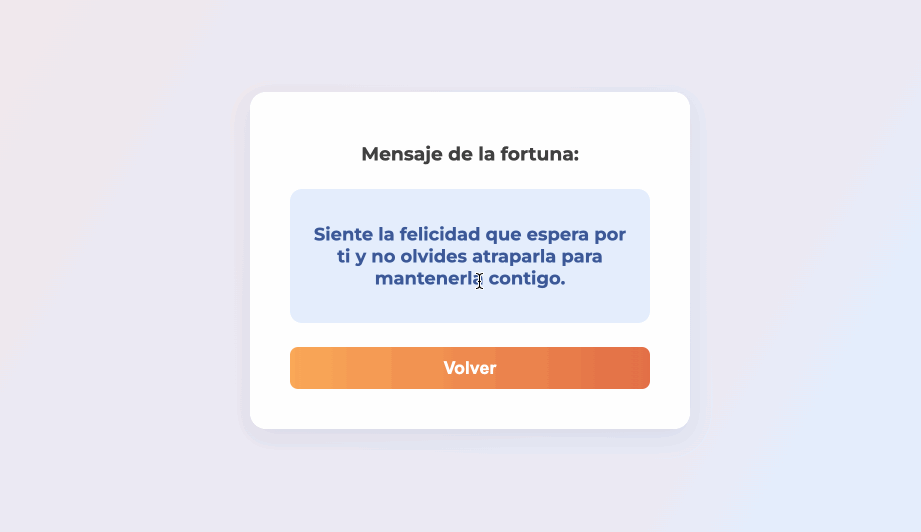

# 🍪 Galleta de la Fortuna

[](https://laravel.com/)
[](https://angularjs.org/)
[](LICENSE)

---

## ✨ Sobre el Proyecto

**Galleta de la Fortuna** es una aplicación web interactiva desarrollada con [Laravel](https://laravel.com/) (API REST) y [AngularJS](https://angularjs.org/) (front-end SPA).  
¿El objetivo? Sortear mensajes de sabiduría inspirados en la clásica *galleta de la fortuna* china, con una experiencia de usuario moderna, atractiva y simple.

- **Login ficticio**: solo tenés que escribir tu nombre.
- **Call to action claro**: botón “ABRE TU GALLETA”.
- **Mensajes aleatorios**: cada vez que sorteás, recibís un nuevo consejo.
- **Backend 100% PHP/Laravel**: API lista para expandir.
- **Frontend desacoplado**: fácil de personalizar y estilizar.
- **Diseño responsivo**: lo podés usar desde el celu o la compu.

---

## 🚦 Tecnologías & Herramientas

- **PHP 8.x**
- **Laravel 10.x**
- **AngularJS 1.8.2** (corriendo en el navegador, ¡sin build!)
- **CSS3** (con Google Fonts)
- **VS Code**
- **Git & GitHub**

---

## 🥇 Demostración



---

## 🧑‍💻 Cómo correrlo localmente

1. **Cloná el repositorio:**
   ```sh
   git clone https://github.com/brunomartins27/galleta-fortuna.git
   cd galleta-fortuna
   composer install

   cp .env.example .env

   php artisan key:generate

   php artisan serve

   http://127.0.0.1:8000/fortune-app/index.html

## 🎲 ¿Cómo funciona?

Pantalla de Login:
Escribís tu nombre (registro ficticio, sin base de datos).

Pantalla de Sorteo:
Hacés click en “ABRE TU GALLETA”.

API REST Laravel:
El front pide /fortune y recibe un mensaje aleatorio de la suerte.

Navegación fluida:
Podés volver, salir y sortear todas las veces que quieras.

## 📁 Estructura del proyecto 

galleta-fortuna/
├── public/
│   └── fortune-app/
│       ├── index.html     // SPA AngularJS
│       ├── app.js        // Lógica AngularJS
│       └── style.css     // Estilização customizada
├── routes/
│   └── api.php           // Rotas da API
├── app/
│   └── Http/
│       └── Controllers/
│           └── FortuneController.php // Controller de mensagens
└── ...

## ✍️ Créditos
Desarrollador Jr: Bruno Martins

## 🤩 Curiosidades Técnicas
No necesita base de datos: ¡los mensajes se sortean directamente desde el backend!

El front-end es estático, pero completamente dinámico con AngularJS puro.

Proyecto fácil de expandir: podés guardar usuarios, agregar base de datos, cambiar frases, crear un ranking, etc.

Listo para deploy en cualquier entorno PHP/Laravel.
